# Fleet System UML Class Diagram

```mermaid
classDiagram
    class Admin {
        +String username
        +String password
        +createAccount()
        +login()
    }

    class Configuration {
        +Boolean maintenanceMode
        +Number locationFrequency
        +updateSettings()
    }

    class PricingDetails {
        +Number baseFee
        +Number perKmPrice
        +updatePricing()
    }

    class Driver {
        +String firstName
        +String lastName
        +String email
        +String phone
        +String password
        +String homeLocation
        +String currentLocation
        +String profilePicture
        +Float farePrice
        +Float baseFee
        +PricingDetails pricingDetails
        +List~Ride~ completedRides
        +String licenseDoc
        +String abstractDoc
        +String criminalRecordCheckDoc
        +String vehicleMake
        +String vehicleModel
        +String vehicleRegistrationDoc
        +String safetyInspectionDoc
        +Boolean applicationApproved
        +Boolean isOnline
        +Ledger ledger
        +updateProfile()
        +toggleAvailability()
        +acceptRide()
        +completeRide()
    }

    class Ledger {
        +Float totalEarnings
        +Float availableBalance
        +List~Transaction~ transactions
        +updateBalance()
    }

    class Transaction {
        +String rideID
        +Float amount
        +String type
        +String status
        +Date timestamp
        +processTransaction()
    }

    class Location {
        +String userId
        +String rideId
        +Float lat
        +Float long
        +Date timestamp
        +updateLocation()
    }

    class Payout {
        +String driverID
        +Float amount
        +String email
        +String status
        +Date requestedAt
        +Date paidAt
        +requestPayout()
    }

    class Receipt {
        +String rideID
        +String riderID
        +String driverID
        +Date timestamp
        +Float baseFare
        +Float distanceFare
        +Float tipAmount
        +Float totalAmount
        +String paymentMethod
        +Float distance
        +Float duration
        +String pickupLocation
        +String dropoffLocation
        +String receiptNumber
        +generateReceipt()
    }

    class Ride {
        +String riderID
        +String driverID
        +String start
        +String end
        +Float fare
        +Float distance
        +String status
        +String cancellationStatus
        +Float tipAmount
        +String stripeTransactionId
        +Date stripeTransactionTime
        +startRide()
        +completeRide()
    }

    class Rider {
        +String firstName
        +String lastName
        +String email
        +String phone
        +String password
        +String homeLocation
        +String profilePicture
        +String currentLocation
        +List~Ride~ completedRides
        +String stripeCustomerId
        +String stripeSetupIntentId
        +String stripePaymentMethodId
        +updateProfile()
        +requestRide()
        +cancelRide()
        +makePayment()
    }

    class Vehicle {
        +String vehicleId
        +String make
        +String model
        +String year
        +String licensePlate
        +String type
        +updateVehicleInfo()
    }

    class Trip {
        +String tripId
        +String pickupLocation
        +String dropoffLocation
        +DateTime requestTime
        +DateTime pickupTime
        +DateTime dropoffTime
        +Float fare
        +String status
        +calculateFare()
        +updateStatus()
    }
```

## Diagram Description

This UML class diagram illustrates the core structure of the Fleet ride-sharing system.

1. **User Hierarchy**: 
   - Specialized Rider, Driver, and Admin classes.

2. **Trip Management**:
   - Riders request trips
   - Drivers fulfill trips
   - Each trip has pickup and dropoff locations

3. **Vehicle Information**:
   - Each driver is associated with a specific vehicle

4. **Payment Processing**:
   - Trip completion generates payment records
   - Payment methods are associated with riders

5. **Location Services**:
   - Location tracking and distance calculation capabilities

The diagram uses standard UML notation for inheritance, associations, and multiplicities to represent the system architecture.