# Fleet Ride-Sharing App User Guide

## Table of Contents
1. [Rider Registration Process](#rider-registration-process)
2. [Driver Registration Process](#driver-registration-process)
3. [Setting Up Payment Method](#setting-up-payment-method)
4. [Rider: Requesting and Taking a Ride](#rider-requesting-and-taking-a-ride)
5. [Driver: Accepting and Completing a Ride](#driver-accepting-and-completing-a-ride)
6. [How to Get a Payout as a Driver](#how-to-get-a-payout-as-a-driver)

## Rider Registration Process

To sign up as a rider in the Fleet app, follow these steps:

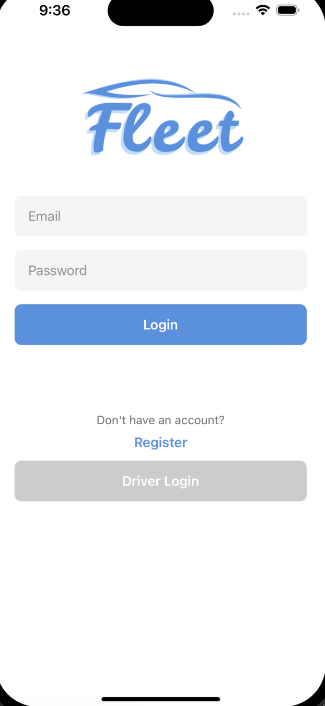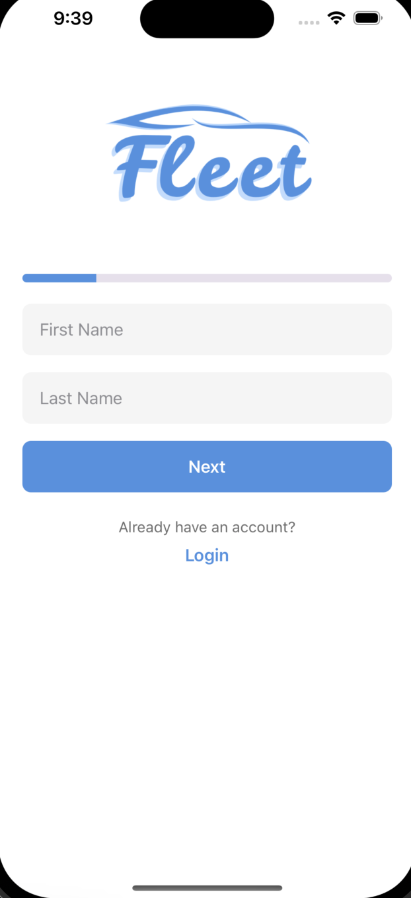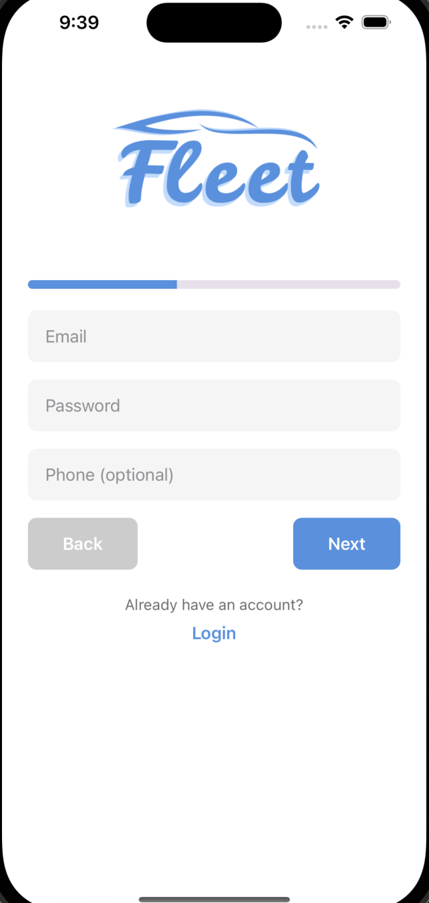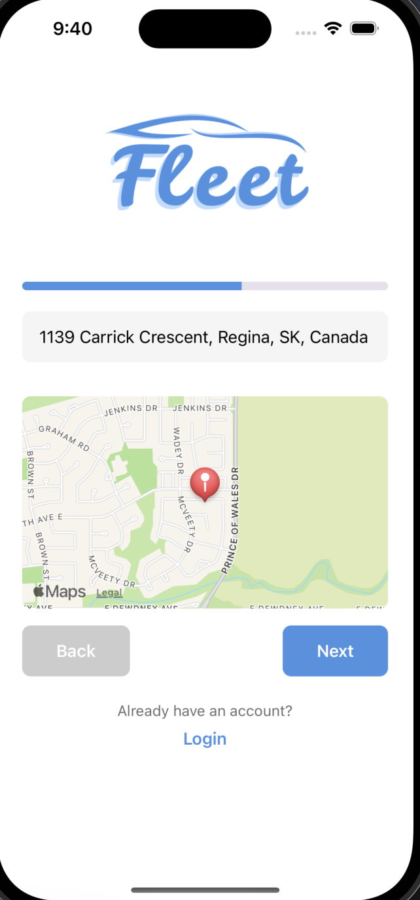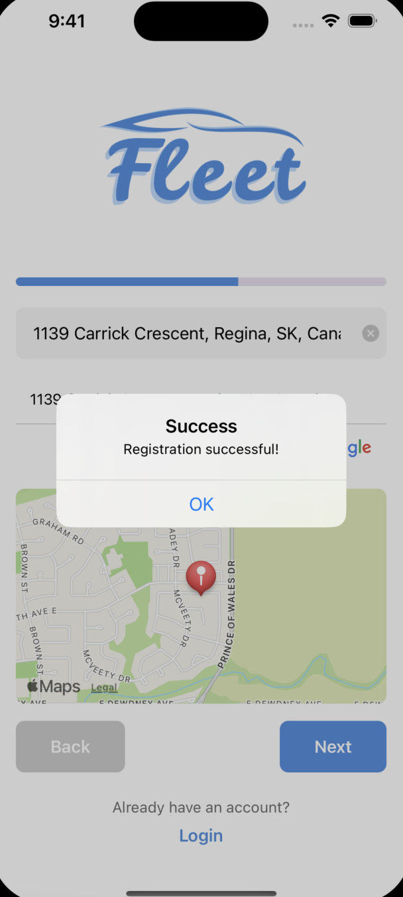

1. **Launch the Fleet App**
   - Open the Fleet mobile application on your device
   - Tap on "Register" on the login screen

2. **Enter Personal Information (Step 1 of 3)**
   - Enter your first name
   - Enter your last name
   - Tap "Next" to proceed

3. **Set Up Account Credentials (Step 2 of 3)**
   - Enter your email address
   - Create a secure password
   - Enter your phone number (optional but recommended)
   - Tap "Next" to proceed

4. **Set Your Home Location (Step 3 of 3)**
   - The app will request permission to access your location
   - Allow location access for a better experience
   - The map will show your current location
   - You can either:
     - Use your current location as your home address
     - Or search for a different address using the search bar
   - Select your preferred location on the map
   - Tap "Register" to complete your registration

5. **Registration Confirmation**
   - Upon successful registration, you'll receive a confirmation message
   - Tap "OK" to be redirected to the login screen
   - Sign in with your newly created credentials

## Driver Registration Process

To sign up as a driver in the Fleet app, follow these steps:

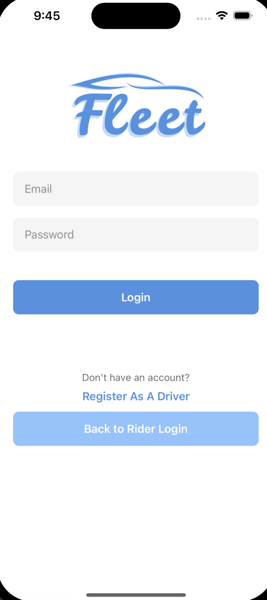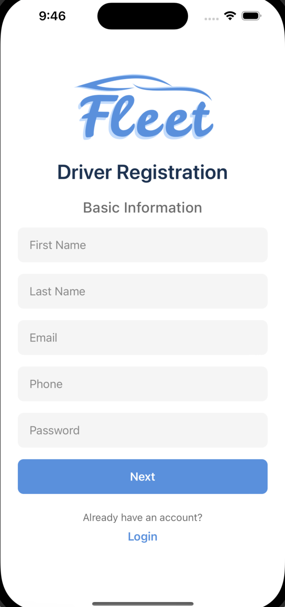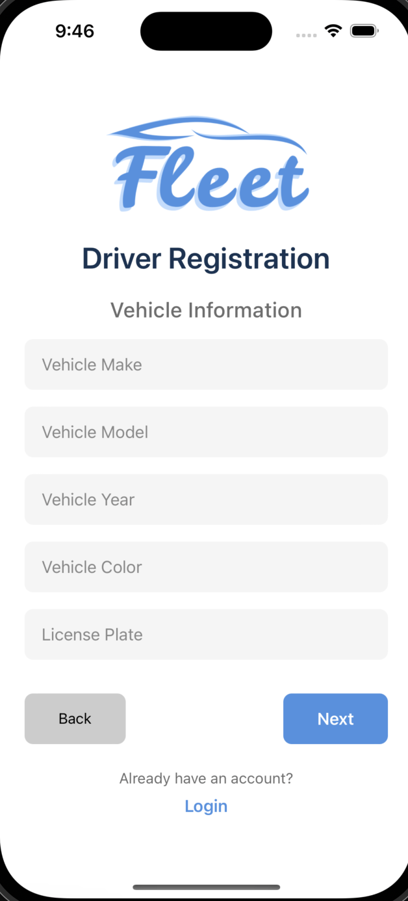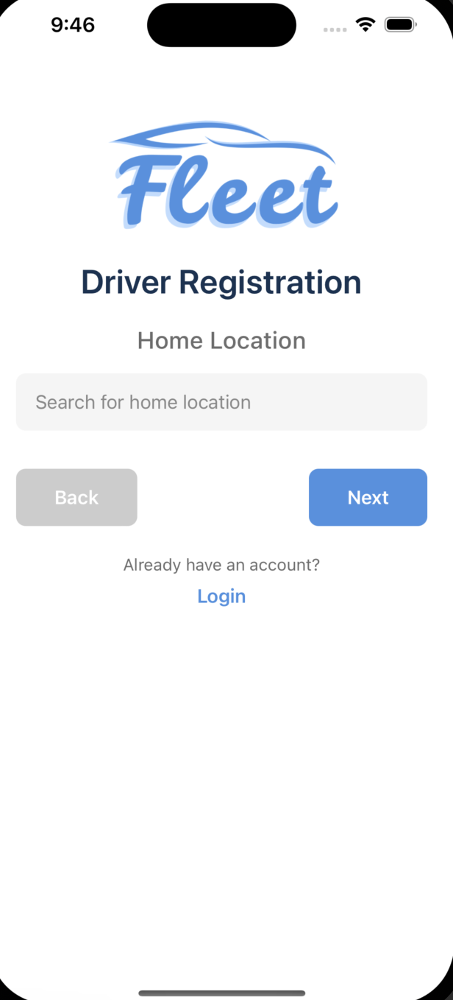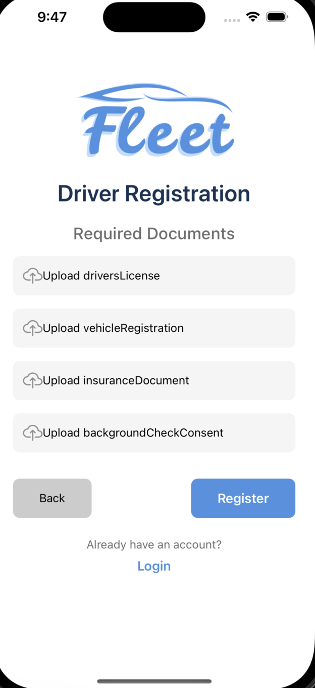

1. **Launch the Fleet App**
   - Open the Fleet mobile application on your device
   - Tap on "Driver Login" on the login screen
   - Tap on "Register" on the driver login screen

2. **Enter Personal Information (Page 1 of 4)**
   - Enter your first name
   - Enter your last name
   - Enter your email address
   - Enter your phone number
   - Create a secure password
   - Tap "Next" to proceed

3. **Enter Vehicle Information (Page 2 of 4)**
   - Enter your vehicle make (e.g., Toyota, Honda)
   - Enter your vehicle model (e.g., Camry, Civic)
   - Enter your vehicle year (e.g., 2022)
   - Enter your vehicle color
   - Enter your license plate number
   - Tap "Next" to proceed

4. **Set Your Primary Location (Page 3 of 4)**
   - The app will request permission to access your location
   - Search for a specific location using the search bar or use your current location
   - Select your location on the map
   - Tap "Next" to proceed

5. **Upload Required Documents (Page 4 of 4)**
   - Upload your driver's license by tapping on "Upload Driver's License"
   - Upload your vehicle registration by tapping on "Upload Vehicle Registration"
   - Upload your insurance document by tapping on "Upload Insurance"
   - Upload your background check consent form by tapping on "Upload Background Check Consent"
   - Tap "Register" to submit your application

6. **Application Review**
   - Your application will be reviewed by the Fleet team
   - After registering, check back in 1-2 business days to see if your application got approved or rejected
   - Once approved, you can log in as a driver

## Setting Up Payment Method

To set up your payment method as a rider, follow these steps:

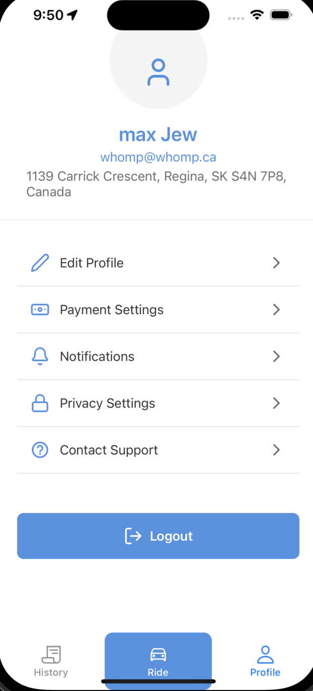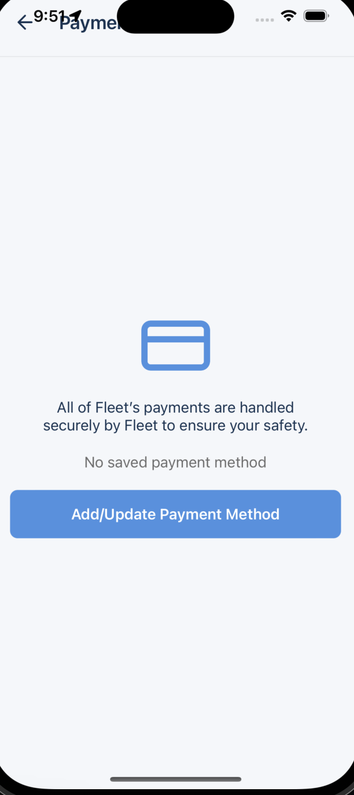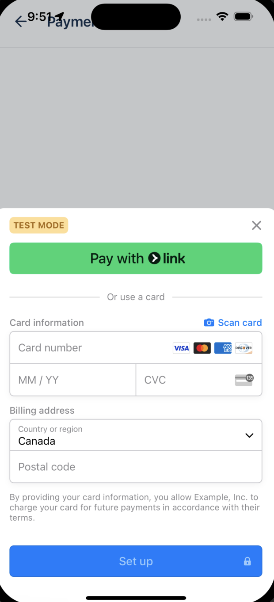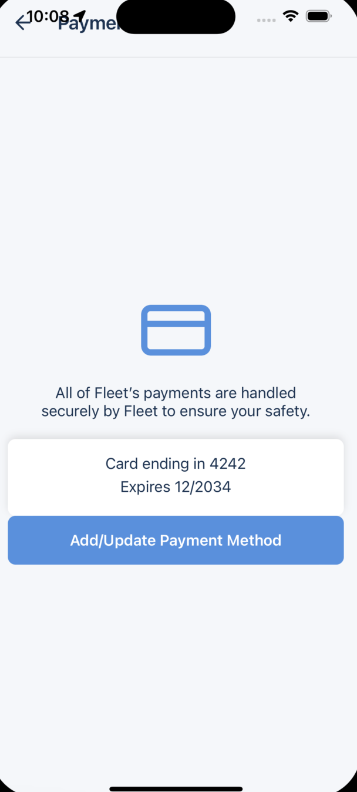

1. **Access Payment Settings**
   - Navigate to the "Settings" tab in the app
   - Tap on "Payment Methods"
   - Or, if prompted during ride booking, tap on "Add a Payment Method"

2. **Add a New Payment Method**
   - Tap on "Add/Update Payment Method"
   - The Stripe payment sheet will open

3. **Enter Payment Information**
   - Enter your card number
   - Enter the expiration date
   - Enter the CVC/security code
   - Enter your name as it appears on the card
   - Enter your billing address if prompted

4. **Save Payment Information**
   - Tap "Save" to store your payment information securely
   - The app uses Stripe for secure payment processing
   - Your payment information is encrypted and stored securely

5. **Confirmation**
   - Once your payment method is added, you'll see your card details (last 4 digits and expiration date)
   - Your payment method is now ready to use for rides

## Rider: Requesting and Taking a Ride

To request and complete a ride as a rider, follow these steps:

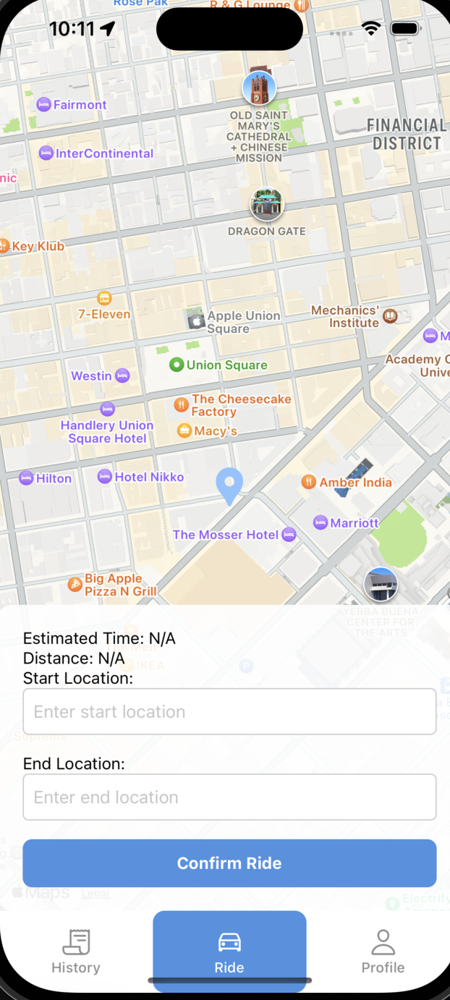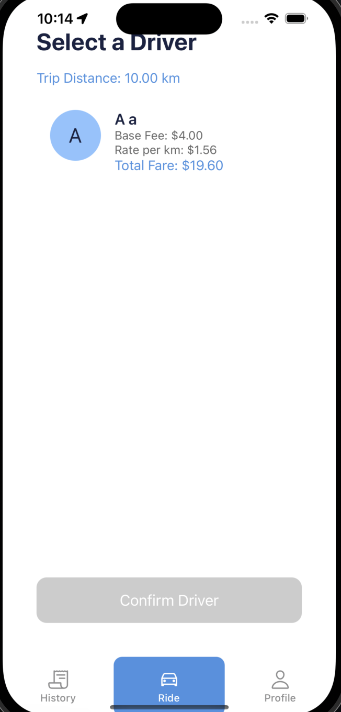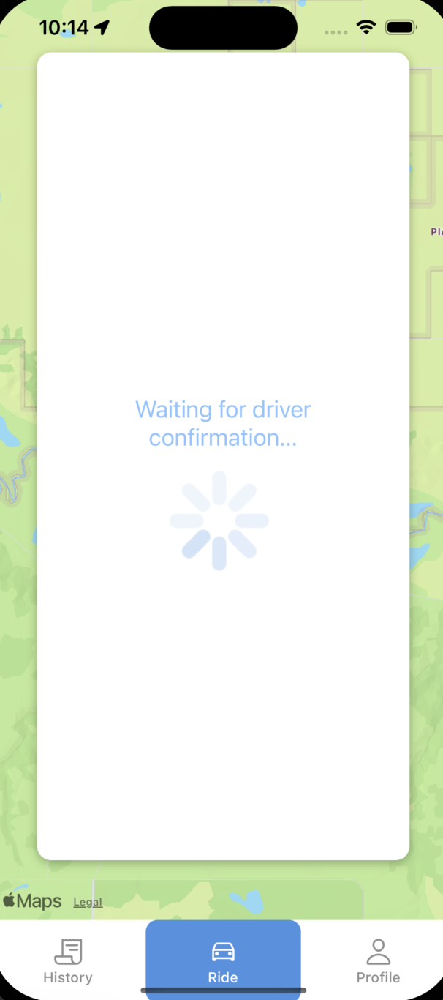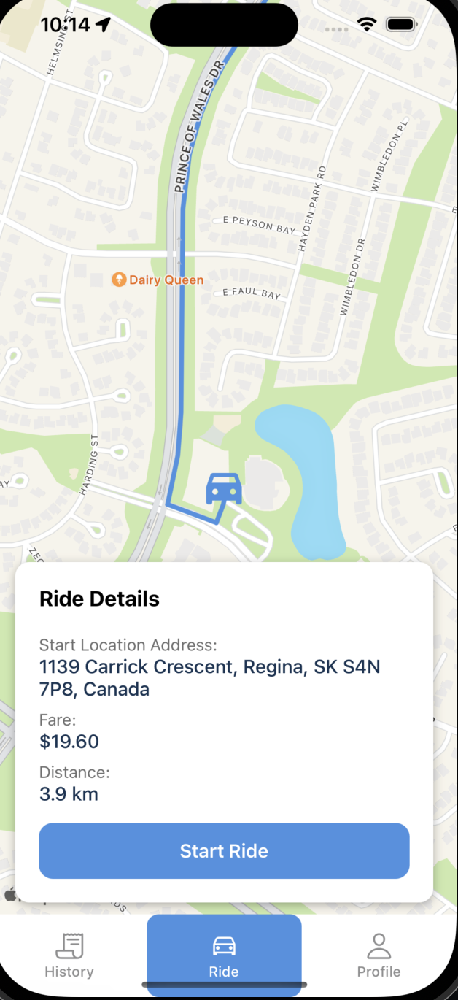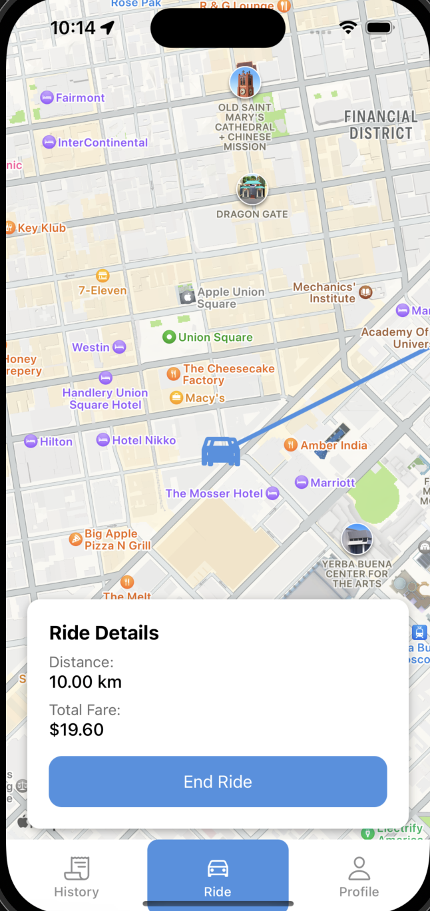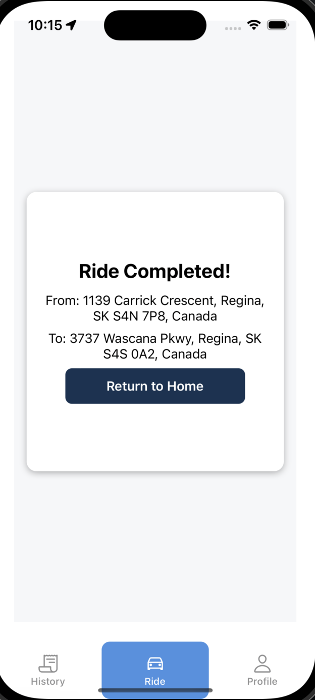

1. **Create a Ride Request (Step 1)**
   - Open the Fleet app and log in
   - On the home screen, enter your destination in the "Where to?" field
   - Use the search functionality or pin on the map to select your destination
   - Confirm your pickup location (defaults to your current location)
   - Tap "Request Ride" to proceed

2. **Driver Selection (Step 2)**
   - The app will display available drivers near your location
   - View driver ratings, vehicle details, and estimated fare
   - The fare is calculated based on distance and base fee
   - Tap on a driver to select them
   - Tap "Confirm" to request the selected driver
   - Note: You must have a valid payment method set up to request a ride

3. **Waiting for Driver Confirmation (Step 3)**
   - The app will display "Waiting for driver confirmation"
   - You can cancel the ride request during this period if needed
   - Once the driver accepts your request, you'll be notified

4. **Preparing for Pickup (Step 4)**
   - Once your driver accepts, you'll see their estimated arrival time
   - Track your driver's location in real-time on the map
   - You'll receive a notification when your driver arrives
   - You can communicate with your driver through the app if needed

5. **During the Ride (Step 5)**
   - When the driver arrives, they will start the ride
   - You can track your journey progress on the map
   - Estimated time of arrival and distance remaining are displayed
   - The driver will end the ride upon reaching your destination

6. **Ride Summary and Payment (Step 6)**
   - After the ride is completed, a summary screen will appear
   - View details including:
     - Total fare
     - Distance traveled
     - Duration of the ride
   - Payment is automatically processed using your stored payment method
   - You can rate your driver and provide feedback
   - Tap "Done" to return to the home screen

## Driver: Accepting and Completing a Ride

To accept and complete a ride as a driver, follow these steps:

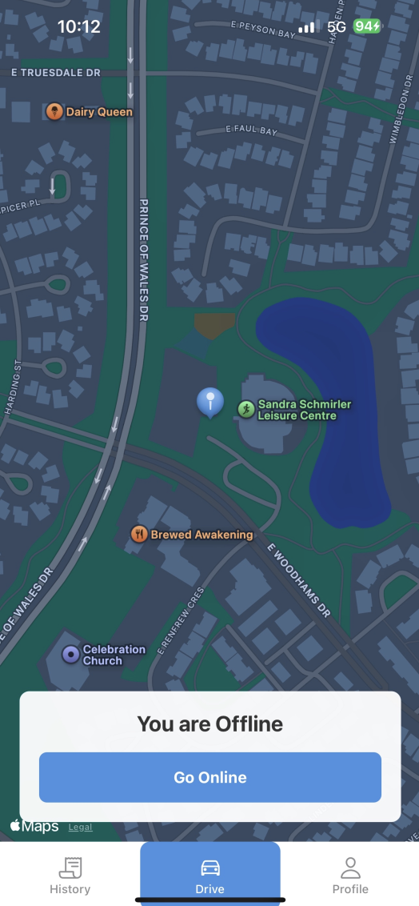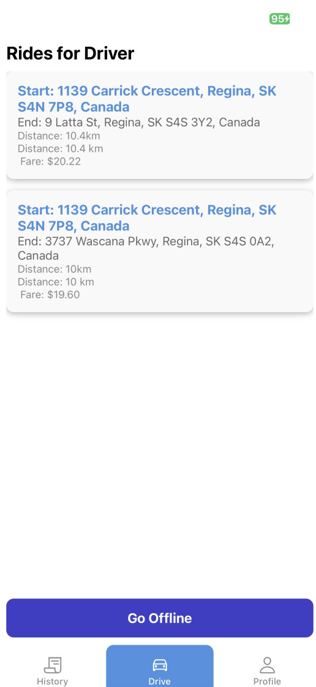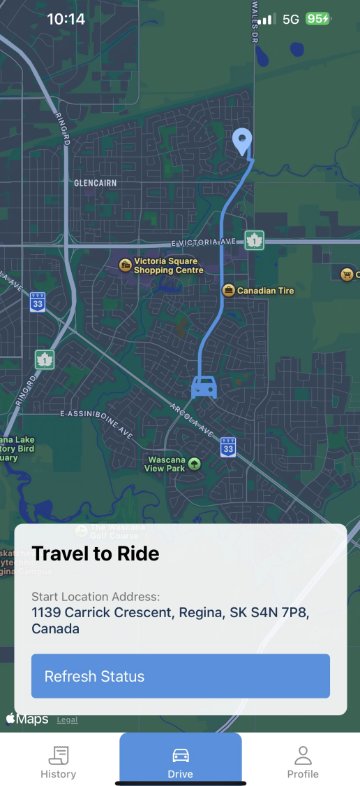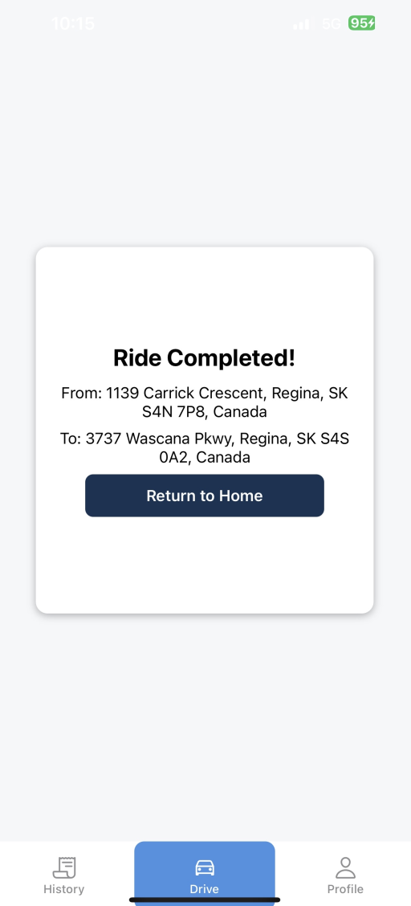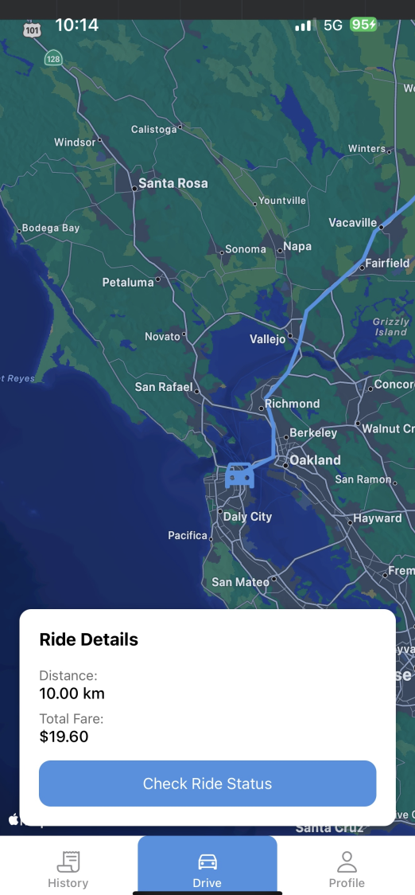

1. **Go Online (Step 1)**
   - Open the Fleet app and log in with your driver credentials
   - On the driver home screen, tap "Go Online" to become available for ride requests
   - Ensure your location services are enabled
   - The app will update your location in real-time to match you with nearby riders

2. **View and Accept Ride Requests (Step 2)**
   - Once online, you'll see a list of ride requests in your area
   - Each request shows:
     - Pick-up location
     - Destination
     - Estimated fare
     - Distance to the pick-up point
   - Tap on a ride to view more details
   - Tap "Accept Ride" to claim the request
   - You can go offline at any time by tapping "Go Offline"

3. **Travel to Rider's Location (Step 3)**
   - After accepting a ride, navigation to the rider's location begins
   - Follow the map directions to reach the pick-up point
   - The rider's real-time location is visible on the map
   - Tap "I've Arrived" when you reach the pick-up location
   - Wait for the rider to come to your vehicle
   - Tap "Start Ride" once the rider is in your vehicle

4. **During the Ride (Step 4)**
   - The app will display navigation to the destination
   - Follow the route shown on the map
   - You can see the estimated time of arrival and distance remaining
   - Drive safely to the rider's destination
   - Tap "End Ride" once you've reached the destination

5. **Ride Completion (Step 5)**
   - After ending the ride, a summary screen will appear
   - View details including:
     - Total fare earned
     - Distance traveled
     - Duration of the ride
   - The payment is automatically processed through the rider's payment method
   - You can view your earnings in the summary
   - Tap "Return to Home" to go back to available rides

6. **Additional Notes**
   - Ensure your driver account is approved before attempting to accept rides
   - Keep your documents up to date to maintain your eligibility
   - Maintain a high rating by providing excellent service to riders

## How to Get a Payout as a Driver

To receive payment for your completed rides, follow these steps:

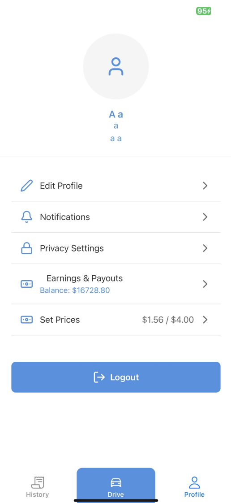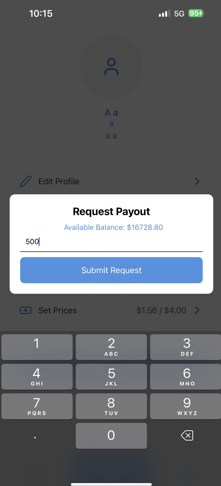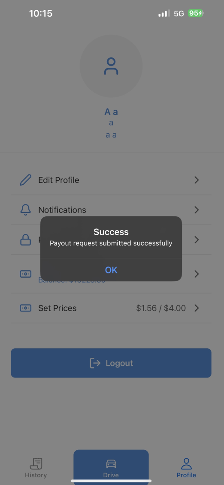

1. **Eligibility**
   - After completing a ride, you are eligible to request a payout
   - Your earnings accumulate in your Fleet driver account

2. **Request a Payout**
   - Navigate to the "Settings" tab in the app
   - Tap on "Request a Payout"
   - Confirm the amount you wish to withdraw

3. **Payout Processing**
   - After requesting a payout, the Fleet staff will check their dashboard to locate the request
   - Staff will review and verify the payout request
   - This process typically takes 1-2 business days

4. **Receive Payment**
   - After locating and approving your request, Fleet staff will proceed with paying out the required balance via e-transfer
   - You will receive an email notification when the e-transfer has been sent
   - Follow the instructions in the email to deposit the funds into your bank account 