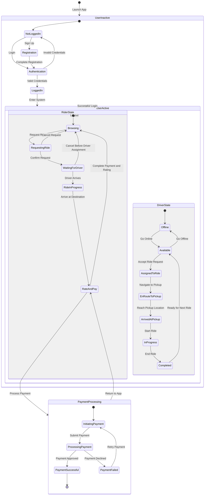

# Fleet System State Chart Diagram

## Diagram Description

This state chart illustrates the various states and transitions within the Fleet ride-sharing system:

### User Authentication Flow
- App begins in inactive state with unauthenticated users
- Users can register or log in to enter the active system state
- Active users can return to inactive state by logging out

### Rider States
- **Browsing**: Default state when rider is logged in but not actively using a ride
- **RequestingRide**: Rider is in the process of requesting transportation
- **WaitingForDriver**: Ride request is confirmed and awaiting driver assignment
- **RideInProgress**: Rider is currently in a vehicle en route to destination
- **RateAndPay**: Post-ride state for payment processing and driver rating

### Driver States
- **Offline**: Driver is logged in but not accepting ride requests
- **Available**: Driver is online and ready to accept rides
- **AssignedToRide**: Driver has accepted a specific ride request
- **EnRouteToPickup**: Driver is navigating to the rider's pickup location
- **ArrivedAtPickup**: Driver has reached the pickup location
- **InProgress**: Driver is transporting rider to destination
- **Completed**: Ride has concluded at the destination

### Payment Processing
- Separate subprocess showing the states involved in processing ride payments
- Handles payment initiation, processing, and success/failure outcomes

This state chart provides a comprehensive view of system behavior, illustrating how users transition between different functional states throughout their journey in the application.