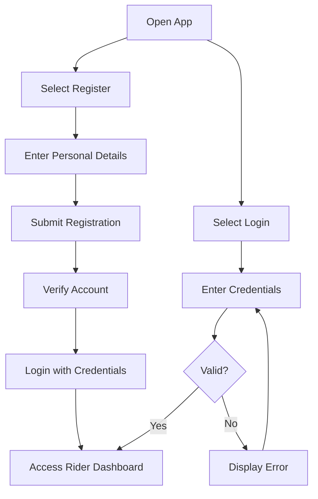
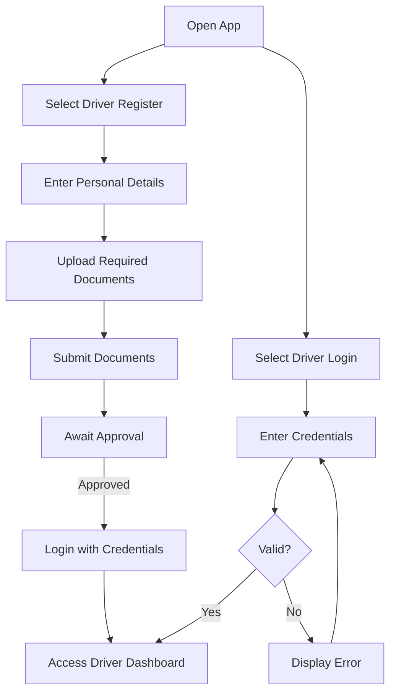
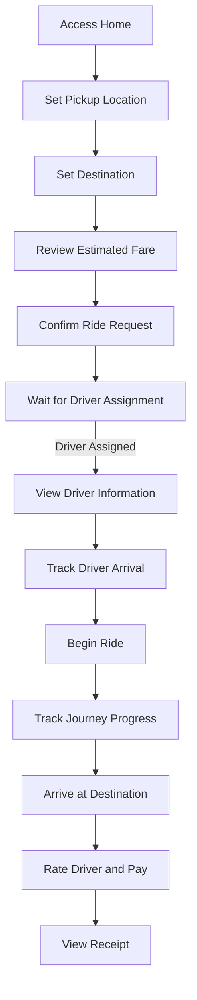
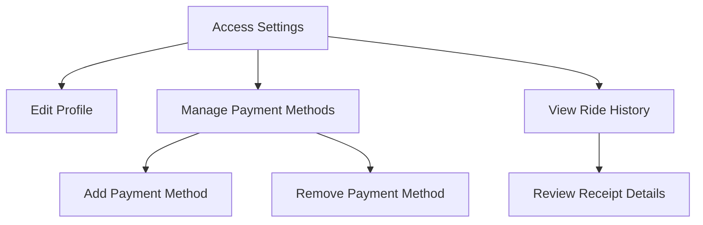
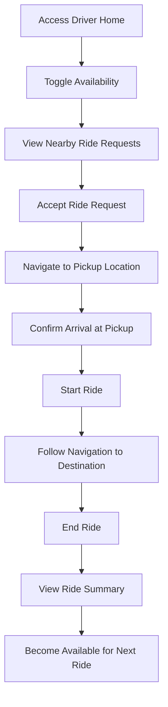
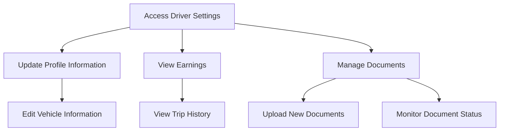
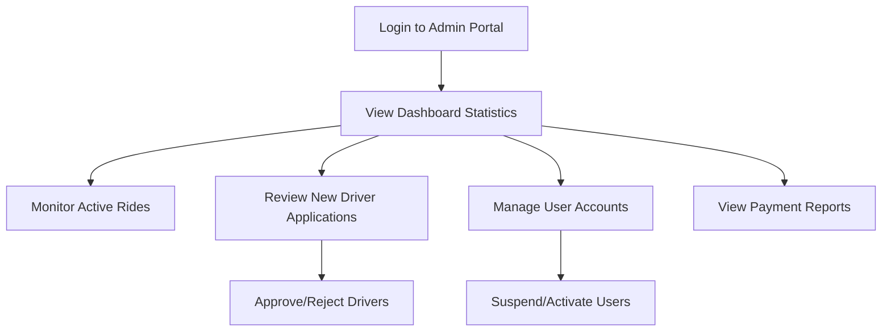

# Fleet System User Interaction Model

This document outlines the primary user interactions and flows within the Fleet ride-sharing platform, based on an analysis of the codebase structure and functionality.

## User Types

Fleet supports three primary user types, each with distinct interaction patterns:

1. **Riders** - Individuals seeking transportation services
2. **Drivers** - Service providers offering transportation
3. **Administrators** - System managers who oversee operations

## Core Interaction Flows

### Authentication Flows

#### Rider Registration and Login

#### Driver Registration and Login

### Rider Interactions

#### Requesting a Ride

#### Managing Profile and Payments

### Driver Interactions

#### Managing Ride Requests

#### Driver Profile Management

### Admin Interactions

#### Admin Dashboard

## Key Interface Elements

### Mobile Application

1. **Authentication Screens**
   - Login (Regular & Driver)
   - Registration (Regular & Driver)
   - Password Recovery

2. **Rider Screens**
   - Home (Map View)
   - Ride Request Form
   - Driver Tracking
   - Ride History
   - Receipt Details
   - Profile Management
   - Payment Methods
   
3. **Driver Screens**
   - Driver Home (Available Rides)
   - Navigation View
   - Ride Management
   - Earnings Summary
   - Document Management
   - Profile Settings

### Web Application

1. **Public Pages**
   - Landing Page
   - About Fleet
   - Driver Signup
   
2. **Admin Dashboard**
   - Analytics Overview
   - User Management
   - Driver Verification
   - Payment Processing
   - Support Ticket Management

## Interaction Patterns

1. **Location-Based Interactions**
   - Real-time location tracking
   - Map-based ride selection
   - Route visualization
   - ETA calculations

2. **Notification Patterns**
   - Push notifications for ride status updates
   - In-app alerts for payment confirmations
   - Email notifications for account activities
   - SMS verification codes

3. **Payment Interactions**
   - Credit card processing via Stripe
   - Receipt generation
   - Fare calculation
   - Payment history viewing

4. **Rating System**
   - Post-ride driver rating
   - Feedback submission
   - Rating visualization

## Security Considerations in User Interactions

1. **Authentication Security**
   - JWT token-based sessions
   - Secure credential storage
   - Multi-factor authentication options

2. **Data Privacy**
   - Location data handling permissions
   - Personal information protection
   - Payment information security

3. **Transaction Security**
   - Secure payment processing
   - Receipt verification
   - Dispute resolution mechanisms

## Accessibility Features

1. **Visual Accessibility**
   - High contrast mode
   - Screen reader compatibility
   - Adjustable text sizing

2. **Input Accommodations**
   - Voice commands
   - Alternative input methods
   - Simplified interface options

This document provides a comprehensive overview of the user interaction patterns within the Fleet system, serving as a reference for understanding the flow of user experiences throughout the application.
